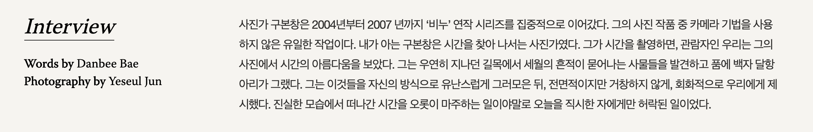
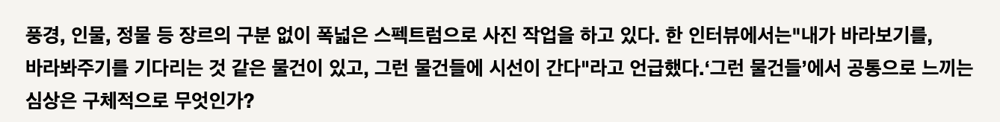
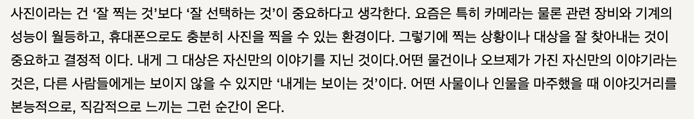
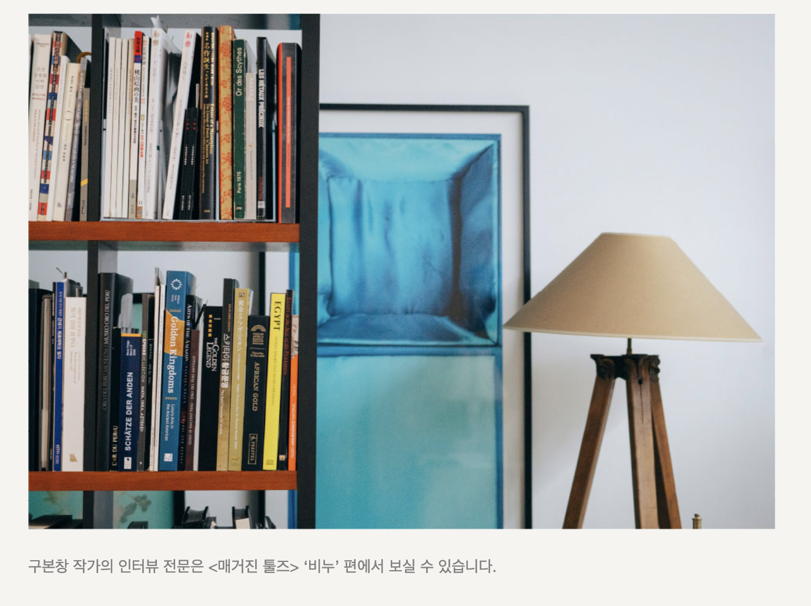
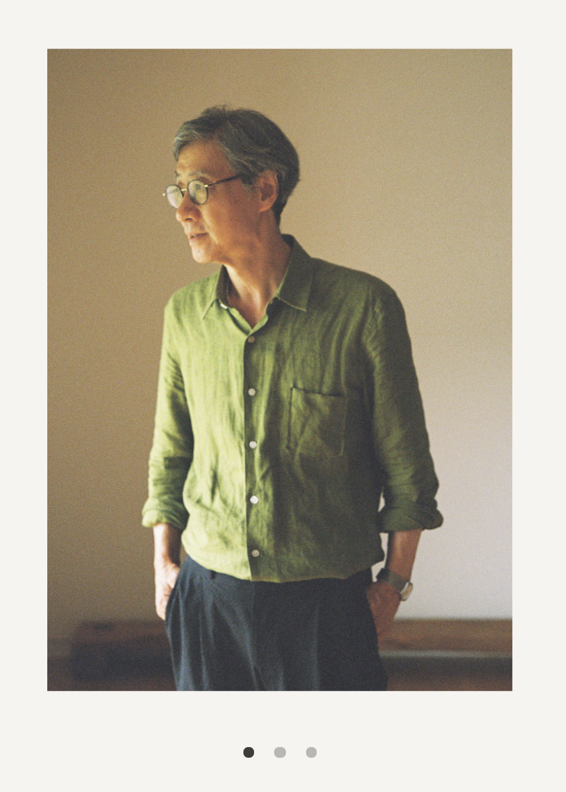

# Tooln
Tooln 매거전을 위한 웹퍼블리싱 작업페이지입니다. 해당 작업물은 HTML, SCSS(CSS),  JAVASCRIPT를 사용하여 만들어졌으며, Webpack을 활용화여 번들링(압축 및 최적화)된 최종결과물을 dist 폴더 내에 생성합니다. 즉, dist폴더 내에 생성된 파일이 FTP에 업로드될 파일입니다.

계약시 말씀드린것과 같이 최종생성된 결과물은 크롬, 파이어폭스, 사파리, 엣지에 최적화되어 있습니다.(인터넷익스플로러와 같은 구브라우저에서는 구동되지 않을 수 있습니다)

## 마크업 페이지

해당 페이지들은 디자인검수 및 개발검수를 위해 임시적으로 생성된 페이지 입니다. 실제 페이지가 아니며 추후 상황에 따라 접속되지 않을 수 있습니다.

* 메인: https://toolsmag.github.io/tooln/dist/
* 어바웃: https://toolsmag.github.io/tooln/dist/about.html
* 아티클: https://toolsmag.github.io/tooln/dist/article.html?temp

## 폴더구조 

```
.
├── .vscode
├── app
│  ├── src
│  │  ├── font                  // AkzidenzGrotesk / WarnockPro
│  │  ├── img                           
│  │  ├── js                    // 자바스크립트
│  │  ├── json                  // DB대신 사용할 아티클 데이터
│  │  ├── scss                  // style 정의
│  │  └── templates             // header/footer등의 공통적으로 사용되는 html
│  │  
│  ├── about.html               // Tooln의 어바웃페이지
│  ├── article.html             // Tooln의 아티클페이지
│  └── main.html                // Tooln의 메인페이지(index.html)
│     
├── dist                        // 최종 번들링된 FTP에 업로드될 결과물
├── issues                      // 디자인검수사항, README, 버그확인을 위한 이미지들
├── .gitignore
├── package-lock.json
├── README.md
└── webpack.config.js
```

## 기타 가이드

개발환경세팅 등 기타 가이드

* 개발환경세팅
* 페이지 수정/개발 최종산출물 생성
* 아티클 리스트 추가 및 아티클페이지 생성
<br/>

### 개발환경 세팅
----
Tooln 웹사이트의 내용 을 수정하기 위해서는 몇가지 설치 및 설정이 필요합니다.

> 1. node 설치
> 2. npm package 설치

#### 1. Node 설치

Node 다운로드 페이지 : [http://www.nodejs.org](http://www.nodejs.org/)

<div style="text-align:center">
  
</div>

```shell
// node설치확인
$ node -v
>>> v12.16.1
```
```shell
// npm 설치확인
$ npm -v
>>> 6.14.4
```

####  2. npm package 설치

```shell
$ cd ~/${파일을_다운받은_디렉토리_경로}
$ npm install
```
<br>

### 페이지 수정/개발 최종산출물 생성
----

#### 1. 개발환경실행

```shell
$ cd ~/${파일을_다운받은_디렉토리_경로}
$ npm start
```

#### 2. 최종산출물 생성

```shell
$ cd ~/${파일을_다운받은_디렉토리_경로}
$ npm run build
```

### 아티클 리스트 추가 및 아티클페이지 생성
----

```
.
├── .vscode
├── app
│  ├── src
│  │  ├── json                     // DB대신 사용할 아티클 데이터
│  │      ├── articles.json        // 아티클 리스트
│  │      ├── temp.json            // 아티클 페이지
~이하생략
```


#### 1. 아티클 리스트 추가

아티클 리스트를 추가 하기 위해서는 `app/src/json/articles.json`을 수정해야합니다.

```json
{
  "initLength": 3,  // 맨처음 화면에 보여질 리스트 수
  "moreLength": 6,  // 아티클이 여러개인 경우 load more 버튼 클릭시 화면에 추가될 리스트 수
  "list": [         // 아티클 리스트 정보들 
    {
      "id": "01",            // 아티클페이지의 관련아티클을 표시할때 사용할 고유식별자
      "type": "type2",       // 아티클리스트의 타입 type1, type2
      "label": "Interview",  // 타이틀 위에 표시될 작은 텍스트
      "title": "비누의 요원한 얼굴<br><strong>구본창 작가</strong>", // 제목
      "link": "./article.html?temp", // 아티클 링크
      "description": "가나다라마바사",   // 마우스오버 혹은 more 버튼 클릭시 보일 텍스트
      "imageURL": "./src/img/article/thumbnails/article01.jpg" // 이미지 썸네일
    },
    ....
  ]
```


#### 2. 아티클 페이지 추가

아티클 페이지는  `app/src/json/`안에 `페이지명.json`으로 새로운 파일을 만듭니다. 그후 필요에 따라 아래 내용을들 추가합니다.
파일명이 페이지에 접속시 사용될 URL이 됩니다.

> 파일명이 article01 인 경우 페이지URL은 "http://tooln.co.kr/article.html?article01"이 됩니다.


```json
{
  "cover": {},    // 메인 커버
  "related": [], // 하단 관련 아티클에 표시할 아티클 리스트
  "contents": [] // 아티클 내용
}
```


#### 1) 메인커퍼

```
"cover": {
	"title": "제목",
	"description": "설명",
  "imageURL": "이미지 URL"
}
```

#### 2) 관련 아티클

 `app/src/json/articles.json`에 입력한 id 값을 넣어줍니다.

```
"related": ["uuid01", "uuid02", "uuid03"],
```
#### 3) 아티클 내용

```
"contents": [...오브젝트로 내용 정의]
```

#### 인트로



```json
{
	"type": "intro",
	"label": "Interview",
	"credits": {
		"Words": "Danbee Bae",
		"Photography": "Yeseul Jun"
	},
	"summary": "내용"
},
```

#### 타이틀



```json
{
	"type": "title",
	"text": "내용"
},
```

#### 텍스트



```json
{
	"type": "text",
	"text": "내용"
},
```

#### 이미지 기본


```
{
	"type": "image",
	"imageURL": "이미지URL",
}
```

#### 이미지 와이드형(+설명글)



```
{
	"type": "image",
	"isWide": true,
	"imageURL": "이미지URL",
	"caption": "이미지설명문구"
}
```

#### 슬라이드



```
{
	"type": "gallery",
	"imageURLs": [
		"./src/img/article/temp/image01.jpg",
		"./src/img/article/temp/image02.jpg",
		"./src/img/article/temp/image03.jpg"
	]
},
```


