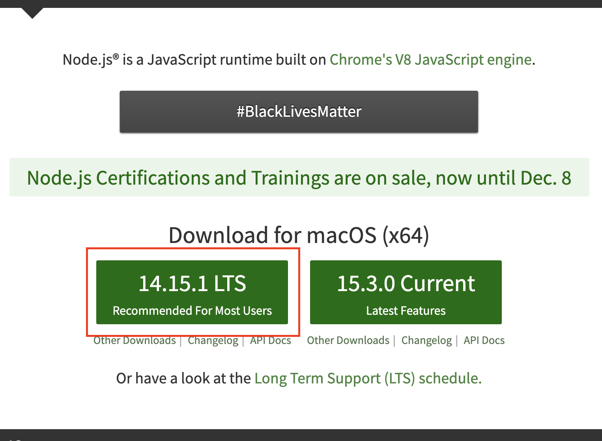

# 개발환경 세팅

Tooln 웹사이트의 내용 을 수정하기 위해서는 몇가지 설치 및 설정이 필요합니다.

> 1. node 설치
> 2. npm package 설치

## 1. Node 설치

Node 다운로드 페이지 : [http://www.nodejs.org](http://www.nodejs.org/)

<div style="text-align:center">
  
</div>


```shell
// node설치확인
$ node -v
>>> v12.16.1
```
```shell
// npm 설치확인
$ npm -v
>>> 6.14.4
```

##  2. npm package 설치

```shell
$ cd ~/${파일을_다운받은_디렉토리_경로}
$ npm install
```
